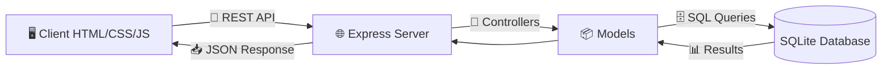
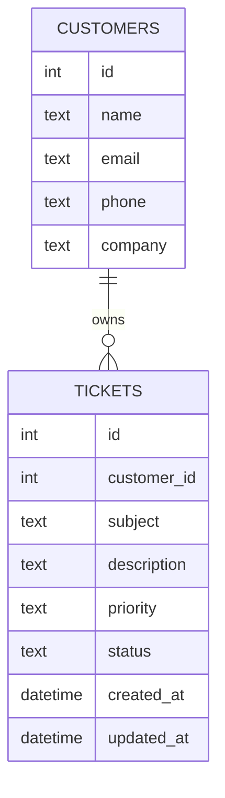
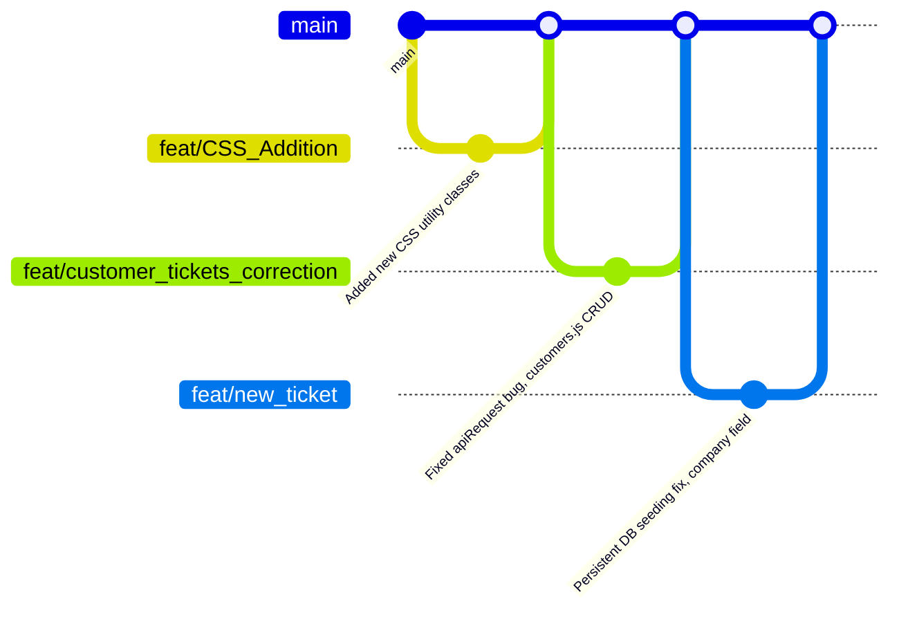

<div align="center">


A full stack **Support Ticket Management System** built with **Node.js, Express, SQLite, HTML, CSS and vanilla JavaScript** as part of the CODOC Intern Programme, Assignment 3.

</div>

<div align="center">

</div>

---

## 📋 Table of Contents

- [🔎 Overview](#-overview)
- [✨ Features](#-features)
- [🛠️ Tech Stack](#️-tech-stack)
- [📁 Project Structure](#-project-structure)
- [🗄️ Database Schema](#️-database-schema)
- [📡 REST API Reference](#-rest-api-reference)
- [🚀 Getting Started](#-getting-started)
- [📖 Usage Guide](#-usage-guide)
- [🔀 Git Workflow](#-git-workflow)
- [✅ Evaluation Rubric Coverage](#-evaluation-rubric-coverage)
- [👥 Team Members](#-team-members)
- [📄 License](#-license)

---

## 🔎 Overview

This application allows a support team to create, manage, and track customer support tickets through a clean, professional web interface. All data is persisted permanently in a SQLite database. Data survives server restarts and application closures.

<div align="center">



</div>

---

## ✨ Features

### 📊 Dashboard
- 📈 Live summary cards: Open, In Progress, Closed, Total tickets
- 🧭 Navigation to Tickets and Customers pages

### 🎫 Ticket Management (Full CRUD)
- ➕ **Create** new tickets with customer, subject, description, priority, and status
- 👁️ **View** ticket detail in a modal with all fields
- ✏️ **Edit** any ticket inline, no page reload required
- 🗑️ **Delete** tickets with confirmation dialog
- 🔍 **Search** by subject, customer name, customer email, or ticket ID
- 🎯 **Filter** by status and or priority simultaneously
- ⚡ Instant UI refresh after every operation

### 👤 Customer Management (Full CRUD)
- ➕ **Create** customers with name, email, phone, and company
- 👁️ **View** customer detail including live ticket count
- ✏️ **Edit** customer information
- 🗑️ **Delete** customers, cascade warning shows ticket count before confirmation
- 🔍 **Search** by name, email, or company
- 🔒 Email uniqueness enforced at both frontend and backend

### 🛡️ Data Integrity
- ✅ Email format validation on both client and server
- ⚠️ Required field validation with inline error messages
- 🚫 Unique email constraint triggers a 409 Conflict response
- 🚫 Invalid priority or status triggers a 400 Bad Request
- 🔐 Parameterized SQL queries throughout, no SQL injection
- 🔗 Foreign key cascades: deleting a customer deletes their tickets

### 💾 Persistence
- 🗄️ SQLite database file (`database.sqlite`) persists between restarts
- 🔁 Schema runs safely on every startup (`CREATE TABLE IF NOT EXISTS`)
- 🌱 Seed data inserted **only on first run**, never duplicates
- 🧩 Non destructive column migration for the `company` field

---

## 🛠️ Tech Stack

<div align="center">

| Layer | Technology |
|-------|------------|
| 🚀 Runtime | Node.js |
| 🌐 Web Framework | Express.js |
| 🗄️ Database | SQLite 3 (via `sqlite3` npm package) |
| 🎨 Frontend | HTML5, CSS3 (Vanilla), JavaScript (ES2020) |
| 🏗️ Architecture | MVC: Routes to Controllers to Models to SQLite |

<br/>


&nbsp;

&nbsp;

&nbsp;

&nbsp;

&nbsp;


</div>

---

## 📁 Project Structure

```
support-ticket-management-system/
├── 📂 client/                     # Frontend (served as static files)
│   ├── index.html                 # Dashboard page
│   ├── css/
│   │   └── style.css              # Complete design system
│   ├── js/
│   │   ├── api.js                 # Fetch wrapper, all REST calls
│   │   ├── ui.js                  # Shared helpers (toast, formatDate, escapeHtml)
│   │   ├── dashboard.js           # Dashboard stats and navigation
│   │   ├── tickets.js             # Tickets page CRUD, search, and filter
│   │   └── customers.js           # Customers page CRUD and search
│   └── pages/
│       ├── tickets.html           # Tickets page
│       └── customers.html         # Customers page
│
├── 🗄️ database/
│   ├── schema.sql                 # Table definitions, trigger, migration
│   └── seed.sql                   # Sample data (inserted once on first run)
│
├── ⚙️ server/
│   ├── server.js                  # Express app setup and static serving
│   ├── config/
│   │   └── database.js            # SQLite connection, schema, and seeding
│   ├── routes/
│   │   ├── tickets.js             # /api/tickets routes
│   │   └── customers.js           # /api/customers routes
│   ├── controllers/
│   │   ├── ticketsController.js
│   │   └── customersController.js
│   └── models/
│       ├── ticketModel.js         # SQL queries for tickets
│       └── customerModel.js       # SQL queries for customers
│
├── 📦 package.json
└── 📘 README.md
```

---

## 🗄️ Database Schema

<div align="center">



</div>

### 👤 `customers`

| Column | Type | Constraint |
|--------|------|------------|
| id | INTEGER | PRIMARY KEY AUTOINCREMENT |
| name | TEXT | NOT NULL |
| email | TEXT | NOT NULL UNIQUE |
| phone | TEXT | optional |
| company | TEXT | optional |

### 🎫 `tickets`

| Column | Type | Constraint |
|--------|------|------------|
| id | INTEGER | PRIMARY KEY AUTOINCREMENT |
| customer_id | INTEGER | NOT NULL, FK to customers(id) ON DELETE CASCADE |
| subject | TEXT | NOT NULL |
| description | TEXT | optional |
| priority | TEXT | CHECK IN ('Low','Medium','High','Critical') DEFAULT 'Medium' |
| status | TEXT | CHECK IN ('Open','In Progress','Closed') DEFAULT 'Open' |
| created_at | DATETIME | DEFAULT CURRENT_TIMESTAMP |
| updated_at | DATETIME | auto updated via trigger |

---

## 📡 REST API Reference

All endpoints are prefixed with `/api`.

### 🎫 Tickets

<div align="center">

| Method | Endpoint | Description |
|--------|----------|-------------|
| 🟢 `GET` | `/api/tickets` | Get all tickets |
| 🟢 `GET` | `/api/tickets/stats` | Dashboard summary counts |
| 🟢 `GET` | `/api/tickets/search?keyword=` | Search by subject, customer name, email, or ID |
| 🟢 `GET` | `/api/tickets/:id` | Get single ticket |
| 🟡 `POST` | `/api/tickets` | Create ticket |
| 🔵 `PUT` | `/api/tickets/:id` | Update ticket |
| 🔴 `DELETE` | `/api/tickets/:id` | Delete ticket |

</div>

**POST / PUT body:**

```json
{
  "customer_id": 1,
  "subject": "Cannot login",
  "description": "Error after password reset.",
  "priority": "High",
  "status": "Open"
}
```

### 👤 Customers

<div align="center">

| Method | Endpoint | Description |
|--------|----------|-------------|
| 🟢 `GET` | `/api/customers` | Get all customers |
| 🟢 `GET` | `/api/customers/:id` | Get single customer |
| 🟡 `POST` | `/api/customers` | Create customer |
| 🔵 `PUT` | `/api/customers/:id` | Update customer |
| 🔴 `DELETE` | `/api/customers/:id` | Delete customer (cascades to tickets) |

</div>

**POST / PUT body:**

```json
{
  "name": "Jane Smith",
  "email": "jane@example.com",
  "phone": "098-765-4321",
  "company": "TechNova Ltd"
}
```

### 📟 HTTP Status Codes

<div align="center">

| Code | Meaning |
|------|---------|
| ✅ `200 OK` | Successful GET, PUT, DELETE |
| ✨ `201 Created` | Successful POST |
| ⚠️ `400 Bad Request` | Missing required fields or invalid value |
| ❓ `404 Not Found` | Resource does not exist |
| ⛔ `409 Conflict` | Duplicate email |
| 💥 `500 Internal Server Error` | Unexpected database error |

</div>

---

## 🚀 Getting Started

### ✅ Prerequisites
- Node.js v18 or later
- npm

<details open>
<summary><b>⚙️ Installation</b></summary>
<br/>

```bash
# Clone the repository
git clone https://github.com/AbdulAzeemHashmi/support-ticket-management-system.git
cd support-ticket-management-system

# Install dependencies
npm install
```

</details>

<details open>
<summary><b>▶️ Running the Application</b></summary>
<br/>

```bash
npm run dev
# or
node server/server.js
```

The server starts at **http://localhost:5000**

- 📊 Dashboard: http://localhost:5000
- 🎫 Tickets: http://localhost:5000/pages/tickets.html
- 👤 Customers: http://localhost:5000/pages/customers.html
- 📡 API: http://localhost:5000/api/tickets

On **first run**, sample data (3 customers, 4 tickets) is automatically inserted. Every subsequent restart skips seeding, your data is never lost.

</details>

---

## 📖 Usage Guide

### 🎫 Creating a Ticket
1. Navigate to the **Tickets** page
2. Click **New Ticket**
3. Select a customer from the dropdown
4. Fill in subject, description, priority, and status
5. Click **Create Ticket**, the list refreshes instantly

### 👤 Managing Customers
1. Navigate to the **Customers** page
2. Click **Add Customer**
3. Fill in name, email, and optionally phone and company
4. Click **Add Customer**

### 🔍 Searching and Filtering
- **Tickets**: search by subject, customer name, email, or ticket ID, filter by Status and or Priority
- **Customers**: search by name, email, or company in real time

### ✏️ Editing and Deleting
- Use the **Edit** button on any row to open the pre filled edit modal
- Use the **Delete** button, a confirmation dialog warns you if the record has related tickets

---

## 🔀 Git Workflow

This project follows a structured feature branch workflow:

<div align="center">



</div>

Each feature is developed on its own branch with a descriptive commit message, reviewed via Pull Request, and merged into `main`.

---

## ✅ Evaluation Rubric Coverage

<div align="center">

| Criterion | Implementation |
|-----------|----------------|
| 🧩 **Working Functionality** | Full CRUD for tickets and customers, search, filter, dashboard stats, all verified with live API tests |
| 🗄️ **Database and API Integration** | Parameterized SQLite queries, proper HTTP status codes, foreign key cascades, persistent storage |
| 🔀 **Git Workflow** | Feature branches, conventional commit messages, Pull Requests |
| 🎨 **UI and UX** | Professional design system (CSS variables, badges, modals, toasts, responsive layout), no page reloads |
| 🏗️ **Code Quality** | MVC architecture, reusable helpers (api.js, ui.js), validation on both layers, error handling |
| 📄 **Documentation** | This README with schema, API reference, setup guide, and usage walkthrough |

</div>

---

## 👥 Team Members

<div align="center">

| Role | Name | GitHub |
|------|------|--------|
| 🧭 Team Lead / Git Manager | Bilal Mughal | [@Bilalmughal-07](https://github.com/Bilalmughal-07) |
| ⚙️ Backend / API Engineer | Abdul Azeem Hashmi | [@AbdulAzeemHashmi](https://github.com/AbdulAzeemHashmi) |
| 🗄️ Database Engineer | Abdul Azeem Hashmi | [@AbdulAzeemHashmi](https://github.com/AbdulAzeemHashmi) |
| 🎨 Frontend Engineer | Emaan Ahmed | [@emaanahmed5](https://github.com/emaanahmed5) |
| 🧪 QA / Documentation | Abdul Rafih Khan | [@RafihKhan-47](https://github.com/RafihKhan-47) |

</div>

---

## 📄 License

This project is for educational purposes as part of the CODOC Intern Development Programme.

---

## 🙏 Acknowledgments

- 🏢 CODOC (PRIVATE) LIMITED for providing this learning opportunity
- 🤝 The internship team for collaboration and support

---

<div align="center">

**Built with ❤️ by the Support Ticket Management Team**

### ⭐ If you found this project useful, consider giving it a star on GitHub


</div>
